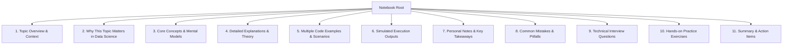

# Repository Structure & Syllabus Alignment Progress

This document provides a comprehensive overview of the restructured `data_science_daily_work` repository, detailing the architecture of the project, the dynamic learning milestones achieved, and the exact anatomical structure and contents of the learning notebooks.

---

## 📂 Reorganized Repository Tree

```text
data_science_daily_work/
├── python/                  # Core Python Foundations (Weeks 1 & 2)
│   ├── basics/              # Syntax, print formats, variables, keywords, data types
│   ├── control_flow/        # Operators, if-else, while/for loops, custom modules
│   ├── strings/             # Intro, indexing, slicing, operations, and string functions
│   ├── problem_solving/     # Loop coding problems, break/continue/pass, time complexity (Big O)
│   ├── data_structures/     # Lists, tuples, sets, dictionaries, comprehensions, zip
│   ├── functions/           # Args/kwargs, scope, closures, lambdas, map/filter/reduce
│   └── README.md            # Detailed study logs and checklists for Core Python
├── advanced_python/         # Advanced Software Engineering (Weeks 3 & 4)
│   ├── oop/                 # OOP constructs, magic methods, static/class methods, OOP project
│   ├── file_handling/       # Safe stream managers, JSON serialization, and binary Pickle
│   ├── exception_handling/  # try-except-else-finally gates, domain custom exceptions
│   ├── decorators/          # Function wrappers, nested namespaces, closures
│   ├── iterators/           # The iteration protocol, custom iterable classes
│   ├── generators/          # Lazy evaluation, memory-optimized yield streams
│   └── README.md            # Checklists and study outcomes for Advanced Python
├── numpy/                   # High-Performance Numerical Engines (Week 5)
│   ├── fundamentals/        # Arrays creation, shape, attributes, reshaping, vector ops
│   ├── advanced_numpy/      # Fancy indexing, logical boolean masks, broadcasting rules, NaN handling
│   ├── numpy_tricks/        # Argsort, hstack/vstack concatenations, percentiles, set functions
│   └── README.md            # Vectorized execution logs and checklists for NumPy
├── pandas/                  # Advanced Data Manipulation (Weeks 6, 7 & 8)
│   ├── series/              # Labeled 1D series, stats mapping, index alignments
│   ├── dataframe/           # 2D grid creation, read_csv config, loc/iloc selections, dynamic filters
│   ├── groupby/             # Split-Apply-Combine patterns, multi-level aggregations
│   ├── merge_join_concat/   # Inner/left/right/outer joins, index alignments, stack/concat
│   ├── multiindex/          # MultiIndex series/dataframes, IndexSlice, stack/unstack
│   ├── pivot_tables/        # Data summarization tables, margins, and custom aggregation aggregates
│   ├── datetime/            # Timestamp parsing, dt accessors, time-delta frequencies
│   ├── string_operations/   # Vectorized text cleanings, regex matching, .str accessors
│   ├── time_series/         # Case studies covering rolling averages, lag features, time offsets
│   ├── case_studies/        # Startup Funding Case Study
│   └── README.md            # Comprehensive checklists and study outcomes for Pandas
├── visualization/           # Aesthetics Styling Guide
│   ├── matplotlib/          # Sourced from matplotlip/ (Subplots layout customization)
│   ├── plotly/              # Sourced from ploty/ (Interactive dashboard visualization widgets)
│   └── README.md            # Visual layouts and custom dashboard logs
├── backend/                 # API Microservices & Schema Architecture
│   ├── fastapi/             # Sourced from Api_work/ (REST APIs, path/query validation)
│   ├── pydantic/            # Sourced from pydantic_learn/ (BaseModel schemas, field validation)
│   └── README.md            # Schema designs and API endpoints logs
├── machine_learning/        # Custom Predictive Engineering
│   └── ml_apps/             # Sourced from ml/ (Machine learning models, algorithms)
├── projects/                # Portfolio Case Studies
│   ├── trader_performance_analysis/ # Sourced from DS_work/ (Bitcoin Fear-Greed vs Trader PnL)
│   ├── lmstudio_chat/       # Sourced from ml/lmstudio-chat/ (Local LLM dynamic frontend)
│   └── README.md            # Portfolio projects overview
├── datasets/                # FLATTENED DATA REPOSITORY (Only data files, no subdirectories)
│   └── [75 raw CSV/Excel/Data files directly under root - e.g. GOOGL.csv, cars.csv]
├── notes/                   # Theoretical summaries and cheat sheets
├── experiments/             # Sandboxing Space
│   └── scratch_notebooks/   # Sourced from test/ (Scratch prototyping notebooks t1-t6)
├── README.md                # General portfolio overview and roadmap
└── project_structure.md     # This structure blueprint document
```

---

## 📓 Jupyter Notebook Anatomy

Every single one of the 90 generated syllabus notebooks is meticulously structured following a uniform, 11-part pedagogical blueprint to look like highly descriptive, human-written, interview-focused revision logs.



### The 11 Pillars of Each Notebook
1.  **Topic Overview**: Standard definitions, vocabulary terms, and entry-level mental models.
2.  **Why This Topic Matters**: Industry perspective, real-world analytical applications, and data pipeline relevance.
3.  **Core Concepts**: Tabulated summaries of core terms, parameter rules, or execution boundaries.
4.  **Detailed Explanations**: Deep dives into mechanical specifics (such as garbage collection, hashing collisions, broadcasting strides, or index alignment).
5.  **Multiple Code Examples**: Highly commented Python code snippets showing basic setups, intermediate pipelines, and advanced engineering patterns.
6.  **Simulated Execution Outputs**: Modeled results in Markdown and code output cells to demonstrate actual shell evaluations.
7.  **Personal Notes & Key Takeaways**: Real student-style handwritten observations, study tips, and memory tricks.
8.  **Common Mistakes & Pitfalls**: Anti-patterns, compilation errors, and silent runtime bugs (e.g. mutable argument traps, sliced copy warnings).
9.  **Technical Interview Questions**: Real-world interview questions (conceptual and coding challenges) along with detailed sample answers.
10. **Practice Exercises**: Challenging hands-on coding prompts designed for self-evaluation.
11. **Summary & Action Items**: Concise summary checklists for quick pre-interview reviews.

---

## 📝 Notebook Contents & Sub-Domain Blueprint

### 📁 `python/` (Weeks 1 & 2 Syllabus)

#### 🔹 `basics/`
*   `python_basics.ipynb`: Syntax entry-point, dynamic type bindings, white-space indentation rules.
*   `print_function.ipynb`: Formatting techniques, custom `sep`/`end` rules, precision f-strings.
*   `data_types.ipynb`: Ints, floats, complexes, lists, tuples, sets, dictionaries, and mutability boundaries.
*   `variables.ipynb`: Memory labels, dynamic pointers, garbage collection counts, `id()` checks.
*   `comments.ipynb`: PEP 257 docstring conventions vs inline comments.
*   `keywords_identifiers.ipynb`: Reserved keywords listing, variable naming rules, shadowing traps.
*   `user_input.ipynb`: shell input interfaces, input string coercion, parsing exception validation.
*   `type_conversion.ipynb`: Implicit datatype promotion vs explicit type casting functions.
*   `literals.ipynb`: Unicode escapings, hexadecimal/binary numbers, raw strings (`r''`) pathing.

#### 🔹 `control_flow/`
*   `operators.ipynb`: Logical vs bitwise gates, assignment math, identity checks (`is`) vs value equality (`==`).
*   `if_else.ipynb`: Sequential branching gates, short-circuit calculations, nested branching cleanups.
*   `while_loop.ipynb`: Sentinel controls, infinite execution prevention, optional `while-else` loops.
*   `for_loop.ipynb`: Sequence iterators, lazy `range()` memory maps, index tracking with `enumerate()`.
*   `modules.ipynb`: Import namespaces, package resolution pathways, `if __name__ == '__main__':` guards.

#### 🔹 `strings/`
*   `strings_intro.ipynb`: Immutability models, memory pointers, character collections.
*   `indexing.ipynb`: Positive and negative bounds, IndexError boundaries.
*   `slicing.ipynb`: Exclusive stop parameters, custom steps, negative step string reversals (`[::-1]`).
*   `string_operations.ipynb`: Concatenation performance, repetition arithmetic, membership matches (`in`).
*   `string_functions.ipynb`: Lower/upper conversions, string trimming, column splits, list joins.

#### 🔹 `problem_solving/`
*   `loop_problems.ipynb`: Sequence algorithms (Fibonacci, factorials, prime checks).
*   `break_continue_pass.ipynb`: Loop modifiers, iteration skips, structural pass placeholders.
*   `time_complexity.ipynb`: Big-O runtime complexities, O(1) vs O(N) vs O(N^2), space complexities.

#### 🔹 `data_structures/`
*   `lists.ipynb`: Dynamic sizing, resizing arrays, pointer reference copying.
*   `tuples.ipynb`: Read-only protection, tuple packing/unpacking, memory comparisons with lists.
*   `sets.ipynb`: Unordered unique sets, O(1) lookup hash tables, intersections and differences.
*   `dictionaries.ipynb`: Key-value dictionaries, hash collision indices, safe `.get()` defaults.
*   `comprehensions.ipynb`: Optimized list/dict/set comprehension pipelines.
*   `zip_function.ipynb`: Multi-iterable alignments, strict matching (`strict=True`), unzipping patterns.

#### 🔹 `functions/`
*   `functions.ipynb`: Reusable functions, parameter signatures, type hinting validations.
*   `args_kwargs.ipynb`: Dynamic arguments list passing (`*args`, `**kwargs`), parameter unpacking.
*   `variable_scope.ipynb`: Local, Enclosing, Global, Built-in (LEGB) scopes, `global`/`nonlocal` state.
*   `nested_functions.ipynb`: Scope hiding, child functions encapsulation.
*   `lambda_functions.ipynb`: Anonymous single-line expressions, custom sorting keys.
*   `higher_order_functions.ipynb`: Dynamic function passing, decorators precursor models.
*   `map_filter_reduce.ipynb`: Map iterators, filter matching masks, cumulative reduce foldings.

---

### 📁 `advanced_python/` (Weeks 3 & 4 Syllabus)

#### 🔹 `oop/`
*   `classes_objects.ipynb`: Creating custom blueprints, instantiations.
*   `constructors.ipynb`: Custom allocations using `__new__` vs `__init__` initializers, Singleton patterns.
*   `self_keyword.ipynb`: Binding instance methods, internal memory pointers.
*   `magic_methods.ipynb`: Custom dunders (`__str__`, `__repr__`, `__len__`, `__getitem__`, `__add__`).
*   `encapsulation.ipynb`: Private (`__`) mangled attributes, getter/setter property decorators.
*   `static_methods.ipynb`: Class factory classmethods, utility staticmethods.
*   `inheritance.ipynb`: Single/multiple parent classes, `super()` chains, Method Resolution Order (MRO).
*   `polymorphism.ipynb`: Method overriding, dynamic dispatch, duck typing interfaces.
*   `abstraction.ipynb`: abc interfaces, `@abstractmethod` implementation enforcement.
*   `oop_project.ipynb`: Fully modular checkout billing project (inheritance, properties, validation).

#### 🔹 `file_handling/`
*   `file_io.ipynb`: Safe stream context managers (`with`), reading line-by-line buffers.
*   `json_serialization.ipynb`: Object-to-string serializations (`dumps`), payload files loading (`load`).
*   `pickle.ipynb`: Python-specific binary saving (`pickle.dump`), security constraints.

#### 🔹 `exception_handling/`
*   `exception_handling.ipynb`: Custom try-except-else-finally handlers, specific built-in catching.
*   `custom_exceptions.ipynb`: Domain exceptions (e.g. OutOfStockError) inheritance blocks.

#### 🔹 `decorators/`
*   `decorators.ipynb`: Timing performance decorators, wraps metadata persistence (`@functools.wraps`).
*   `namespaces.ipynb`: Enclosing closures, dynamic config bindings.

#### 🔹 `iterators/` & `generators/`
*   `iterators.ipynb`: Iteration protocol (`__iter__`, `__next__`), StopIteration bounds.
*   `generators.ipynb`: Yield generators, dynamic generator expressions, lazy evaluations.

---

### 📁 `numpy/` (Week 5 Syllabus)

#### 🔹 `fundamentals/`
*   `numpy_arrays.ipynb`: Creation arrays, contiguous C memory models, list performance benchmarks.
*   `array_attributes.ipynb`: shape, ndim, size, and dtype parameters.
*   `array_operations.ipynb`: Vectorized mathematical calculations, unary aggregation functions.
*   `vector_operations.ipynb`: Dot product calculations, matrix multiplication (`@`), transposition.
*   `reshaping.ipynb`: Shape manipulation (`.reshape()`), copies (`.flatten()`) vs views (`.ravel()`).

#### 🔹 `advanced_numpy/`
*   `indexing.ipynb`: Slicing dimensions, stride indexing, memory view updates.
*   `fancy_indexing.ipynb`: Coordinate integer list indexing, independent copies.
*   `boolean_indexing.ipynb`: Conditional mask arrays filtering, bitwise logical combining.
*   `broadcasting.ipynb`: Dimension stretching rules, compatibility checks.
*   `missing_values.ipynb`: NaN allocations, `np.isnan()` matching, nan-safe sums.

#### 🔹 `numpy_tricks/`
*   `sort.ipynb`: Sorting indices using `np.sort()` and sorting mappings using `np.argsort()`.
*   `concatenate.ipynb`: Horizontal (`hstack`) and vertical (`vstack`) aggregations.
*   `percentile.ipynb`: Median, standard deviations, custom percentile statistics.
*   `set_functions.ipynb`: Unique sets (`np.unique()`), intersections, array differences.

---

### 📁 `pandas/` (Weeks 6, 7 & 8 Syllabus)

#### 🔹 `series/` & `dataframe/`
*   `pandas_series.ipynb`: Labeled 1D series indexing, index mappings.
*   `series_methods.ipynb`: Statistical summaries (`.describe()`), frequency maps (`.value_counts()`), mapping operations (`.map()`).
*   `boolean_indexing.ipynb`: Conditional Series filters using bitwise operators.
*   `dataframe_creation.ipynb`: Instantiating 2D tables from arrays, dicts, lists.
*   `read_csv.ipynb`: Custom separators, chunk parsing, type specifications.
*   `dataframe_methods.ipynb`: Core summary methods (`.info()`, `.head()`, `.drop()`).
*   `filtering.ipynb`: Multi-conditional row filters using `.loc[]` and `.iloc[]` bounds.
*   `adding_columns.ipynb`: Column engineering, avoiding chained index warnings.

#### 🔹 `groupby/` & `merge_join_concat/`
*   `groupby_basics.ipynb`: The Split-Apply-Combine mechanic, row divisions.
*   `aggregation.ipynb`: Custom multi-level column calculations using `.agg()`.
*   `merge.ipynb`: Inner, outer, left, right database merges, overlapping suffixes.
*   `join.ipynb`: Left/Right joining on indices, comparing to merge operations.
*   `concat.ipynb`: Stacking series/dataframes vertically (axis=0) and horizontally (axis=1).
*   `startup_funding_case_study.ipynb`: Portfolio case study cleaning currencys and analyzing investor trends.

#### 🔹 `multiindex/` & `pivot_tables/`
*   `multiindex_series.ipynb`: Multi-level series slicing, sorting level indices.
*   `multiindex_dataframe.ipynb`: Hierarchical columns slicing using IndexSlice, swapping levels.
*   `stack_unstack.ipynb`: Pivoting row/column levels to transpose data structures.
*   `pivot_table.ipynb`: Tabular aggregates summaries, margins, and custom totals.

#### 🔹 `datetime/` & `string_operations/`
*   `pandas_datetime.ipynb`: String to datetimes parse, extracting components (`.dt`), delta offsets.
*   `vectorized_string_operations.ipynb`: Vectorized text matching (`.str.contains()`), regex splits.

#### 🔹 `time_series/`
*   `time_series_case_study.ipynb`: Dynamic rolling averages, lag shifting (`.shift(1)`), Stock timelines.
*   `textual_data_case_study.ipynb`: Cleaning columns, regex replacements, NLP preprocessing.

---

## 🛠 Repository Tech Stack

*   **Languages**: Python 3.12+, JavaScript (React/Vite)
*   **Data Processing**: Pandas, NumPy, Scikit-learn, Scipy
*   **Visualizations**: Matplotlib, Seaborn, Plotly Express
*   **API & validation**: FastAPI, Uvicorn, Pydantic v2
*   **Environments**: Jupyter Notebooks, UV package manager

---
*Last Updated: June 2026*
